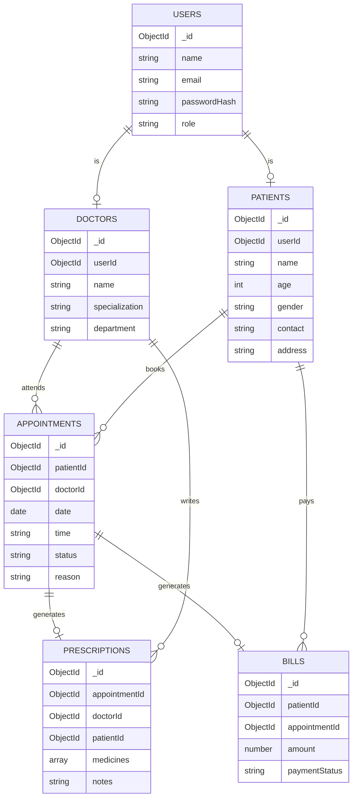

# Entity Relationship Diagram — Hospital Management System

## Relationship Summary

| Relationship | Cardinality |
|---|---|
| Doctor → Appointments | 1 : N |
| Patient → Appointments | 1 : N |
| Appointment → Prescription | 1 : 1 |
| Appointment → Bill | 1 : 1 |
| Doctor → Prescriptions | 1 : N |
| Patient → Bills | 1 : N |
| User → Doctor / Patient | 1 : 1 |