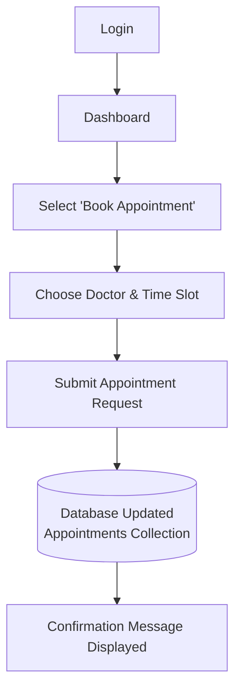

# Application Workflow — Hospital Management System

Example: booking an appointment.

## Step-by-Step

1. **Login** — user authenticates with email/password (JWT issued).
2. **Dashboard** — user lands on their role-specific dashboard.
3. **Select "Book Appointment"** — patient navigates to the appointment booking page.
4. **Choose Doctor & Time Slot** — patient picks an available doctor and slot.
5. **Submit Appointment Request** — form data is sent to the backend via a `POST /api/appointments` request.
6. **Database Updated** — a new document is created in the `Appointments` collection with status `pending`.
7. **Confirmation Message Displayed** — the frontend shows a success message and the new appointment appears in "My Appointments."